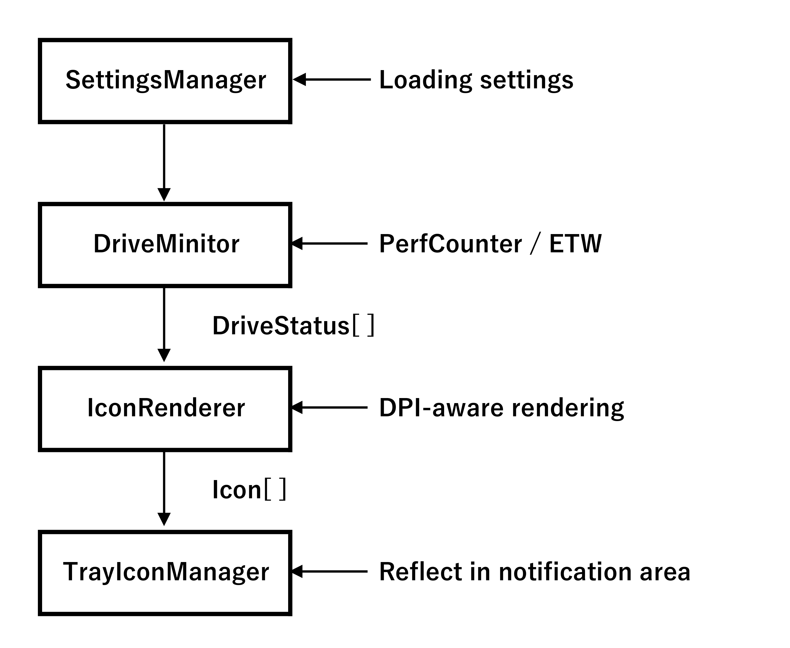

[←Previous](00_Technical_documents(en).md) | [Next→](02_Architecture(en).md) | [Top](00_Technical_documents(en).md)  

## 1\. Overview  

### 1.1 What is Drive Indicator AI?  

    Drive Indicator AI is a lightweight utility that visualizes Windows storage I/O (read/write) status  
    in real time using a task tray icon.  
    Its greatest feature is its ability to monitor not only standard disk I/O but also RAM drive I/O,  
    which is difficult to obtain using conventional monitoring methods, with high accuracy using ETW (Event Tracing for Windows).  
    It is also designed with practicality and scalability in mind, with features such as DPI support,  
    multilingual support, auto-start, and logging.  
    The impetus for creating this application came from using a free software application with similar functionality.  
    However, the icon arrangement wasn't what I wanted, and it stopped working properly after the OS was upgraded to Windows 11.  
    This prompted me to think, "Why not just make one myself?" I consulted with AI Copilot, who told me,  
    "It's easy!" So I set about creating it.  
    I added "AI" to the end of the application name to express my gratitude to AI Copilot for their cooperation.  

### 1.2 Main Features (Technical Perspective)  
    1. High-Precision I/O Monitoring  
      ･ PerformanceCounter monitors I/O for standard drives  
      ･ ETW (FileIORead / FileIOWrite) monitors RAM drives  
      ･ Integrated with DriveStatus and passed to TrayIconManager  
    2. Full DPI Support  
      ･ Automatically switches between 16px and 32px icons depending on the DPI  
      ･ IconRenderer determines the DPI and performs optimal drawing  
      ･ Fonts use GraphicsUnit.Pixel to absorb DPI differences  
    3. Multilingual Support (JSON-Based)  
      ･ Reads languages.json and lang_xx.json files in the ApplicationFolder/Resources/Language folder  
      ･ LangManager manages translation tables  
      ･ All UI text is managed by keys, making it easy to expand  
    4. Automatic Execution (Task Scheduler Method)  
      ･ StartupHelper generates XML and executes "schtasks.exe"  
      ･ No privileges required, no UAC impact  
      ･ Safer and more reliable than the Registry Run key  
    5. Logging Function (with Rotation)  
      ･ Saves logs to the %TEMP%/DriveIndicatorAI/Log folder  
      ･ Rotates to .old when files exceed 1MB  
      ･ Thread-safe writing  

### 1.3 Features of the Overall Architecture  
    Drive Indicator AI is designed based on a clear separation of responsibilities, as follows :  
      ･ SettingsManager: Reading, writing, and persisting settings  
      ･ DriveMonitor: I/O monitoring (PerfCounter + ETW)  
      ･ IconRenderer: DPI-aware icon drawing  
      ･ TrayIconManager: Notification area icon management and updating  
      ･ LangManager: Multilingual text management  
      ･ LogHelper: Log management (with rotation)  
      ･ UI (SettingsForm / VersionInfoForm / LicenseDialog): User operations and setting changes  
    This structure completely separates the UI and logic, making the app highly scalable and maintainable.  

### 1.4 Data Flow Overview (Simplified Version)  
 

[←Previous](00_Technical_documents(en).md) | [Next→](02_Architecture(en).md) | [Top](00_Technical_documents(en).md)  