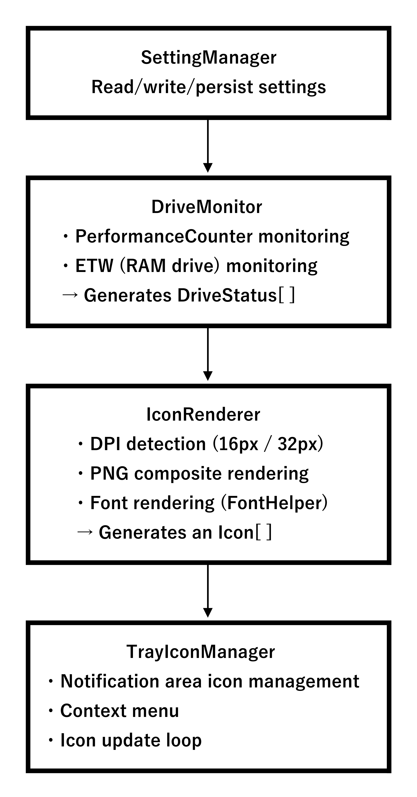
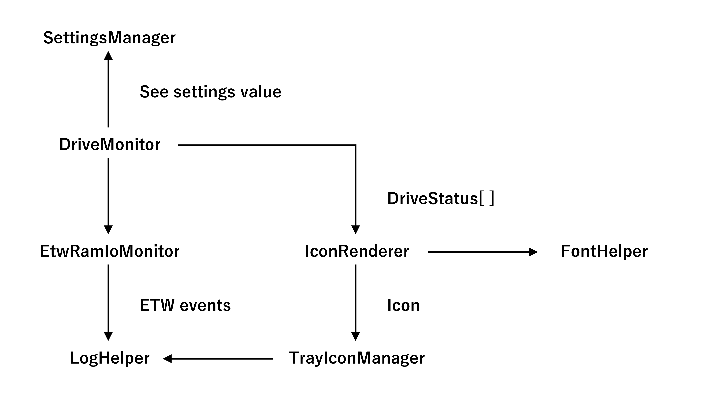
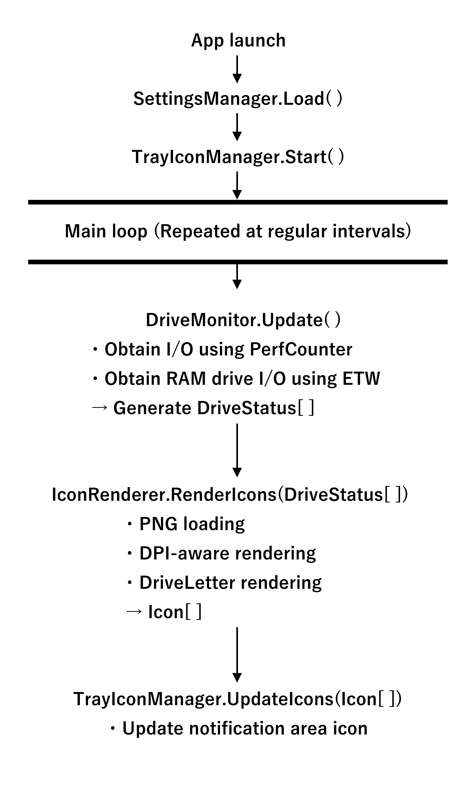

[←Previous](01_Overview(en).md) | [Next→](03_Components(en).md) | [Top](00_Technical_documents(en).md)  

## 2\. Architecture Overview  
    Drive Indicator AI is structured so that multiple independent components work together to perform a series of processes :  
      Monitoring → Status Update → Icon Drawing → Notification Area Update  
    This section explains the overall structure in three parts: a "Component Diagram", a "Class Dependency Diagram",  
    and a "Process Flow Diagram".  

### 2.1 Component Diagram  
 

### 2.2 Class Dependency Diagram  
 

    Dependency Points  
      ･ TrayIconManager is the core of the application and uses both DriveMonitor and IconRenderer.  
      ･ DriveMonitor integrates PerfCounter and ETW.  
      ･ IconRenderer uses FontHelper.  
      ･ LogHelper is referenced by all components (cross-cutting concerns).  
      ･ SettingsManager is the foundation for providing overall settings.  

### 2.3 Process Flow Diagram (Monitoring → Rendering → Display)  
    Drive The main loop of Indicator AI runs as follows :  
 

### 2.4 Architecture Features (Summary)  
    ･ Clear separation of responsibilities  
        UI, settings, monitoring, rendering, and logging are completely independent  
    ･ Highly extensible  
        Easy to add new languages, icon themes, and monitoring methods  
    ･ Robust DPI support  
        IconRenderer and FontHelper absorb DPI differences  
    ･ Powerful RAM drive monitoring  
        Using ETW allows you to obtain information that cannot be obtained with general tools  
    ･ Logs support the entire system  
        All exceptions and internal operations are recorded, making debugging easy  

[←Previous](01_Overview(en).md) | [Next→](03_Components(en).md) | [Top](00_Technical_documents(en).md)  