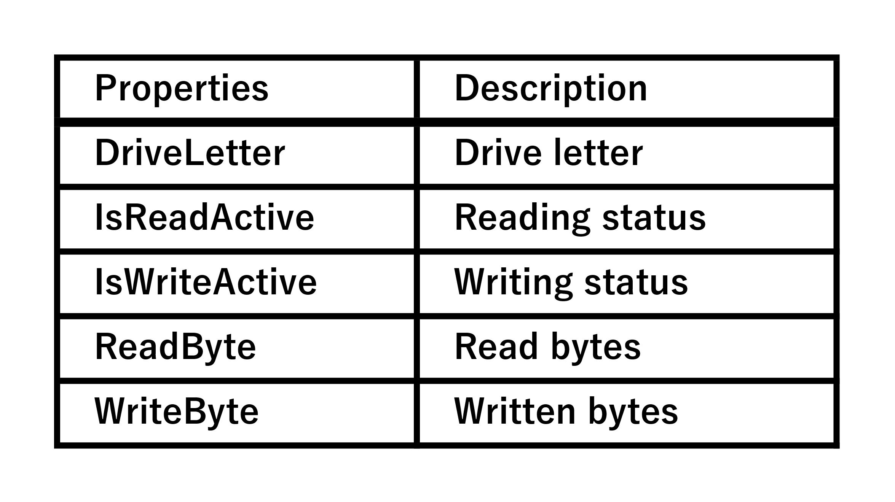

[←Previous](04_UI(en).md) | [Next→](06_DPI(en).md) | [Top](00_Technical_documents(en).md)  

## 5\. Data Flow Details  
    Drive Indicator AI operates in the following sequence :  
      Start → Load settings → Start monitoring  
        → Draw icon → Update notification area → Shutdown process  
    This section explains in detail how data flows within the app and which components operate at what timing.  

### 5.1 App startup → Load settings  
    When the app starts, the following process is performed by Program.cs.  
      1. SettingsManager.Load()  
      2. LangManager.Load(languageCode)  
      3. TrayIconManager.Start()  

#### 5.1.1 SettingsManager.Load()  
    ･ Loads the settings file (JSON)  
    ･ Uses default values ​​if loading fails  
    ･ Stores language code, monitored drives, update interval, etc. in memory  

#### 5.1.2 LangManager.Load()  
    ･ Loads Resources/Language/lang_xx.json  
    ･ Builds translation table  
    ･ Prepares UI text  

#### 5.1.3 TrayIconManager.Start()  
    ･ Extracts icon PNG to TEMP  
    ･ Initializes DriveMonitor  
    ･ Starts icon update loop  

#### 5.2 Start monitoring → Updates DriveStatus  
    The TrayIconManager main loop calls DriveMonitor.Update() at regular intervals. will be called.  

      DriveMonitor.Update()  
        ├─ Obtain I/O for the normal drive using PerfCounter  
        ├─ Obtain I/O for the RAM drive using EtwRamIoMonitor  
        └─ Generate DriveStatus[]

#### 5.2.1 PerformanceCounter Processing  
    ･ LogicalDisk ReadBytes/sec  
    ･ LogicalDisk WriteBytes/sec  
    ･ Obtain values ​​for each drive letter  
    ･ If a threshold is exceeded, determine that "read/write is active"  

#### 5.2.2 ETW Processing (RAM Drive)  
    ･ Monitor FileIORead/FileIOWrite events  
    ･ Extract DriveLetter  
    ･ Reflect byte count in DriveStatus  
    ･ Safely terminate with CancellationToken  

#### 5.2.3 Generating DriveStatus  
    DriveStatus contains the following information :  

### 5.3 Icon Drawing → IconRenderer  
    Upon receiving DriveStatus[], the TrayIconManager requests the IconRenderer to draw the icon.  

      IconRenderer.RenderIcons(DriveStatus[])  
        ├─ DPI Determination (16px / 32px)  
        ├─ PNG Loading  
        ├─ DriveLetter Drawing (FontHelper)  
        ├─ Color Composition According to I/O Status  
        └─ Icon[] Generation  

#### 5.3.1 DPI Determination  
    Refer to SettingsManager.Current.Dpi or Graphics.DpiX :  
      ･ Less than 144 DPI → 16px  
      ･ 144 DPI or More   → 32px  
    Automatically selects one of the following.  

#### 5.3.2 Loading PNG  
      ･ Read icon         : (write_off_read_on_.png)  
      ･ Write icon        : (write_on__read_off.png)  
      ･ Idle icon         : (write_off_read_off.png)  
      ･ Both active icon  : (write_on__read_on_.png)  

    Combine these to create a single icon.  

#### 5.3.3 Drawing DriveLetter  
    FontHelper returns a font appropriate for the DPI, so characters do not appear distorted even at high DPI settings.  

### 5.4 Updating the Notification Area Icon → TrayIconManager  
    The Icon[] generated by the IconRenderer is received, and the TrayIconManager reflects it in the notification area.  

      TrayIconManager.UpdateIcons(Icon[])  
        ├─ Set to NotifyIcon.Icon  
        ├─ Discard the old icon with DestroyIcon  
        ├─ Update the context menu  
        └─ Wait until the next loop  

#### 5.4.1 Icon Destruction  
    Use the Win32 API DestroyIcon to prevent GDI resource leaks.  

#### 5.4.2 Context Menu  
      ･ Settings  
      ･ Quit  
    and other items are multilingualized using LangManager.  

### 5.5 Termination Processing → Stop ETW and save logs  
    TrayIconManager.Dispose() is called when the app terminates.  

      TrayIconManager.Dispose()  
        ├─ DriveMonitor.StopEtwMonitor()  
        ├─ NotifyIcon.Dispose()  
        ├─ Disposing of the Icon  
        └─ FontHelper.ClearCache()  

#### 5.5.1 Stopping ETW  
    ･ Issue a CancellationToken  
    ･ Safely stop the TraceEventSession  
    ･ Ensure the thread is terminated  

#### 5.5.2 Disposing of the Icon  
    ･ Release all GDI resources  
    ･ It is okay to leave the PNG in TEMP  

#### 5.5.3 Disposing of the Font Cache  
    FontHelper.ClearCache() ensures that Font.Dispose() is called.  

### 5.6 Data Flow Characteristics (Summary)  
    Drive Indicator AI's data flow has the following characteristics :  
      ･ Asynchronous processing is safely managed  
          ETW is stopped by a CancellationToken  
          PerfCounter is protected by exception handling  
      ･ DPI and I/O status are reflected in real time  
          Icon drawing is performed for each loop  
      ･ Strict separation of responsibilities  
          Monitoring, drawing, UI, and configuration are completely independent  
      ･ Logs support the entire system  
          All exceptions and internal operations are recorded  

[←Previous](04_UI(en).md) | [Next→](06_DPI(en).md) | [Top](00_Technical_documents(en).md)  