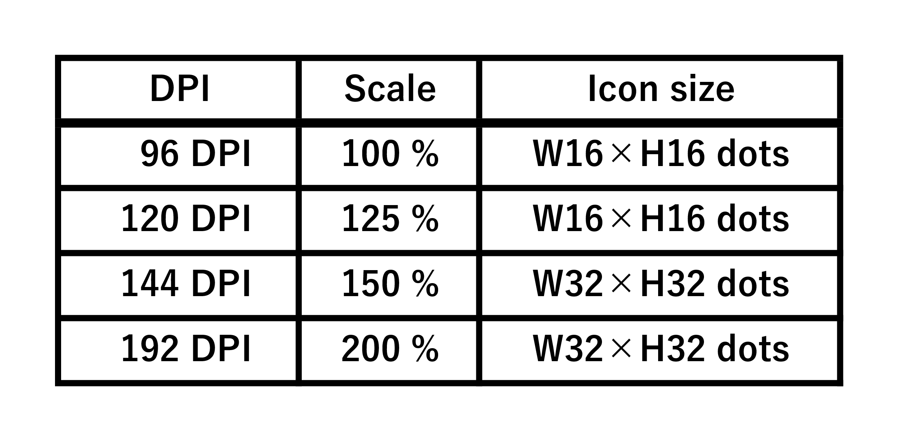

[←Previous](05_Dataflow(en).md) | [Next→](07_ETW(en).md) | [Top](00_Technical_documents(en).md)  

## 6\. DPI Support Details (High-DPI Support)  
    Drive Indicator AI automatically switches between 16px and 32px icons depending on the Windows DPI setting,  
    ensuring beautiful icon display even in high-resolution environments.  
    WinForms is notoriously difficult to support DPI, but Drive Indicator AI's unique DPI design ensures stable drawing  
    and UI display.  

### 6.1 Purpose of DPI Support  
    In Windows, the size of task tray icons changes depending on the DPI :  
 

    Drive Indicator AI automatically selects the optimal icon size for the DPI setting based on this specification.  

### 6.2 How DPI is Determined  
    DPI is determined by combining the following two pieces of information :  
      1. SettingsManager.SizeChangeDpi (fixed value of 144 DPI)  
      2. Graphics.DpiX (runtime DPI)  

#### 6.2.1 DPI Determination Logic (Simplified)  
      ─────────────────────────────────────────  
      if (dpi >= SettingsManager.SizeChangeDpi)  
          IconSize = 32px  
      else  
          IconSize = 16px  
      ─────────────────────────────────────────  
    SizeChangeDpi is managed in the settings file and is set to 144 DPI (150%) by default.  

### 6.3 DPI Awareness with IconRenderer  
    IconRenderer changes the following depending on the DPI :  
      • Icon size (16px / 32px)  
      • Drive letter font size  
      • PNG icon destination folder (16 / 32)  
      • Drawing position (DriveSize / LetterSize)  

#### 6.3.1 Determining Icon Size  
    ────────────────────────────────────────────────  
    int iconSize = (dpi >= SizeChangeDpi) ? 32 : 16;  
    ────────────────────────────────────────────────  

#### 6.3.2 PNG Destination  
    ────────────────────────  
    Icons/Default/16/xxx.png  
    Icons/Default/32/xxx.png  
    ────────────────────────  

#### 6.3.3 Adjusting Drawing Position  
    DriveSize / LetterSize is automatically calculated according to DPI, so characters will not be crushed or misaligned.  

### 6.4 DPI Font Management with FontHelper  
    The most difficult part of DPI support is managing font size.  
    Drive Indicator AI generates fonts that are not affected   
    by DPI by using GraphicsUnit.Pixel.  

#### 6.4.1 Key Points for Font Generation  
    ───────────────────────────────────────────────────────────────────  
    new Font("Segoe UI", fontSize, FontStyle.Bold, GraphicsUnit.Pixel);  
    ───────────────────────────────────────────────────────────────────  
      • Specifying Pixels → No automatic scaling based on DPI.  
      • Characters are not crushed.  
      • The DriveLetter in the icon always looks beautiful.  

#### 6.4.2 Font Caching  
    FontHelper caches fonts for each DPI, improving performance by not generating them every time.  

### 6.5 DPI Sample Display in SettingsForm  
    The PictureBox in SettingsForm draws a sample icon using the same logic as the actual task tray.  
      • Same rendering process as IconRenderer  
      • FontHelper DPI fonts  
      • PNG composition  
      • DriveLetter rendering  
    This allows users to see how the settings will look before changing them.  

### 6.6 DPI-Aware Design Philosophy (Summary)  
    Drive Indicator AI's DPI support has the following features :  
      1. Avoids WinForms DPI issues  
        • No automatic scaling; everything is controlled manually  
        • DPI-independent fonts using GraphicsUnit.Pixel  
      2. Icon drawing is fully DPI-aware  
        • 16px/32px PNGs are provided  
        • Automatically switches according to DPI  
        • DriveLetter position and size are also adjusted according to DPI  
      3. The UI is also DPI-aware  
        • Sample drawing in SettingsForm  
        • PictureBox DPI support  
        • Icon appearance is always consistent  
      4. Highly extensible  
        • Easily supports new DPIs (such as 48px)  
        • Icon themes are easily added  

[←Previous](05_Dataflow(en).md) | [Next→](07_ETW(en).md) | [Top](00_Technical_documents(en).md)  