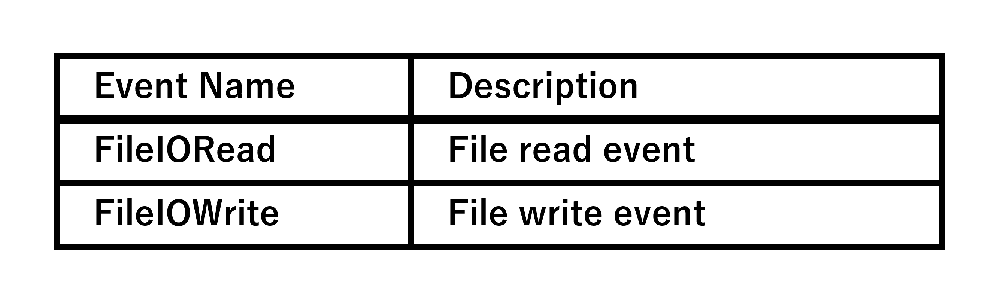

[←Previous](06_DPI(en).md) | [Next→](08_Startup(en).md) | [Top](00_Technical_documents(en).md)  

## 7\. ETW Details (Event Tracing for Windows Details)
    One of the greatest features of Drive Indicator AI is its ability to monitor RAM drive I/O  
    with high accuracy using ETW (Event Tracing for Windows).  

    Normal PerformanceCounter cannot capture RAM drive I/O.  
    For this reason, Drive Indicator AI directly analyzes ETW FileIORead / FileIOWrite events  
    to accurately detect RAM drive reads and writes.  
    This chapter provides a detailed explanation of how this works for developers.  

### 7.1 Why ETW is Needed  

#### 7.1.1 PerformanceCounter Limitations  
    Windows PerformanceCounter (LogicalDisk) :  
      • Does not recognize RAM drives as "disks"  
      • Read/write byte counts are always 0  
      • No instances exist for some RAM disk software  
    As a result, RAM drive I/O cannot be monitored using normal methods.  

#### 7.1.2 Advantages of ETW  
    ETW can directly obtain events issued by the Windows kernel, allowing :  
      • Reliably detect I/O even on RAM drives  
      • Accurately obtain byte counts  
      • High speed and low load  
      • No administrator privileges required (FileIO events can be obtained in user mode)  
    This is why Drive Indicator AI can accurately monitor RAM drives.  

### 7.2 Events Monitored by ETW  
    Drive Indicator AI monitors the following two types of ETW events :  
 

    These events are issued by the KernelTraceControl provider.  

### 7.3 Structure of EtwRamIoMonitor  
    EtwRamIoMonitor is a monitoring class dedicated to RAM drives.  

      EtwRamIoMonitor  
        ├─ Start()  
        ├─ Stop()  
        ├─ ProcessEvent()  
        ├─ CancellationToken  
        └─ DriveLetter → ReadBytes / WriteBytes  

#### 7.3.1 Start()  
    • Create a TraceEventSession  
    • Subscribe to FileIORead / FileIOWrite  
    • Start event processing in a separate thread  

#### 7.3.2 Stop()  
    • Issue a CancellationToken  
    • Safely stop the session  
    • Terminate the thread reliably  

#### 7.3.3 ProcessEvent()  
    • Extract the DriveLetter from the event  
    • Pass the number of bytes to DriveMonitor  
    • Update the read/write flag  

### 7.4 How to Extract the DriveLetter  
    ETW FileIO events include the file path (e.g., C:\path\file.txt).  
    Drive Indicator AI extracts the DriveLetter from this path :  
      ──────────────────────────────  
      The first character (e.g., C)  
      ──────────────────────────────  
    The same is true for RAM drives :  
      ──────────────────────────────  
      R:\temp\file.bin → R
      ──────────────────────────────  

### 7.5 Threading and Cancellation Handling  
    ETW receives events in real time, so they must be processed in a dedicated thread.  
    Drive Indicator AI :  
      • Start the ETW thread with Task.Run()  
      • Stop it with CancellationTokenSource  
      • Safely terminate when Stop() is called  

#### 7.5.1 Why Safe Shutdown is Important  
    If an ETW session is not stopped :  
      • The session will remain  
      • A "duplicate session name" error will occur the next time the system is started  
      • It will cause a memory leak  
    Drive Indicator AI completely avoids this issue by reliably closing the session with Stop().  

### 7.6 Working with DriveMonitor  
    EtwRamIoMonitor passes the following to DriveMonitor in real time :  
      • DriveLetter  
      • ReadBytes  
      • WriteBytes  
    DriveMonitor combines this with the results of PerformanceCounter to generate the final DriveStatus.  
      ──────────────────────────────  
      PerfCounter → Normal Drive  
      ETW         → RAM Drive  
      ──────────────────────────────  
    This is the division of roles.  

### 7.7 How to Test ETW  
    To confirm ETW operation, developers can :  
      1. Create a RAM drive (e.g., ImDisk)  
      2. Launch Drive Indicator AI  
      3. Copy files to the RAM drive  
      4. Check whether the icon changes to red or green  
      5. Check whether ETW events are recorded in the log  
    This confirms that ETW is working correctly.  

### 7.8 Features of the ETW Implementation (Summary)  
    Drive Indicator AI's ETW implementation has the following features :  
      1. Accurately captures RAM drive I/O  
          Capable of capturing information that cannot be obtained with general tools.  
      2. Low load and high speed  
          ETW is a high-speed tracing mechanism standard in Windows.  
      3. No administrator privileges required  
          FileIO events can be captured in user mode.  
      4. Secure session management  
          Stop() reliably terminates sessions and prevents lingering.  
      5. DriveMonitor Integration  
          PerfCounter and ETW are integrated to centrally manage all drives.  

[←Previous](06_DPI(en).md) | [Next→](08_Startup(en).md) | [Top](00_Technical_documents(en).md)  