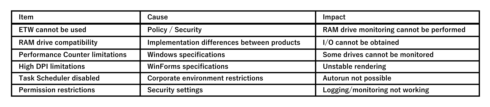

[←Previous](11_Extensibility(en).md) | [Next→](13_License(en).md) | [Top](00_Technical_documents(en).md)  

## 12. Known Limitations
    Drive Indicator AI operates using Windows I/O monitoring functions (PerformanceCounter/ETW).  
    However, these mechanisms are subject to OS constraints and external environmental influences,  
    and there are some aspects that cannot be fully controlled by the app.  
    This chapter explains the known limitations of Drive Indicator AI and  
    the reasons and background for them.  

### 12.1 ETW is Unavailable in Some Environments  
    ETW (Event Tracing for Windows) can normally be used in user mode,  
    but it may not work in the following environments :  

      ● Restrictions  
        • ETW is disabled by policy in a corporate environment  
        • Security software blocks ETW  
        • The Windows tracing service is stopped  
        • Another application occupies a session with the same name  

      ● Impact  
        • RAM drive I/O cannot be obtained  
        • DriveMonitor determines the RAM drive to be "always idle"  
        • ETW errors are recorded in the log  

      ● Workarounds  
        • Use unique session names to avoid collisions (already implemented)  
        • Skip RAM drive monitoring if ETW is unavailable  

### 12.2 Incompatibility with Some RAM Drive (RAM Disk) Software  
    Since RAM drive implementations vary depending on the software, ETW FileIO events may not occur in some products.  

      ● Impact  
        • Events are not sent to ETW even when reads or writes are performed.  
        • Drive Indicator AI displays the drive as "Idle (no reads or writes)".  

      ● Typical Examples  
        • RAM drives that use proprietary drivers to handle I/O.  
        • Products that do not issue Windows FileIO events.  

### 12.3 PerformanceCounter Limitations  
    PerformanceCounter (LogicalDisk) has the following limitations due to Windows specifications.  

      ● Limitations  
        • Some USB memory sticks are not recognized as "disks".  
        • Volumes without a drive letter cannot be monitored.  
        • Instance names may vary depending on the OS.  
        • The counter value may be 0 until it is initialized.  

      ● Impacts  
        • Certain drives are not displayed as monitored targets.  
        • I/O may not be acquired immediately after startup.  

### 12.4 WinForms Limitations in High DPI Environments  
    Drive Indicator AI implements its own DPI support,  
    but the following issues may occur due to limitations in WinForms itself.  

      ● Restrictions  
        • A restart is required immediately after changing the Windows DPI setting.  
        • PictureBox rendering may be delayed in some environments.  
        • Mixing DPI settings in a multi-monitor environment may cause unstable rendering.  

      ● Impacts  
        • Sample icons may be momentarily distorted.  
        • DPI changes may not be reflected immediately.  

### 12.5 Environments with Task Scheduler Disabled  
    Drive Indicator AI runs automatically via Task Scheduler,  
    but Task Scheduler may be disabled in corporate environments.  

      ● Impacts  
        • Unable to register automatic execution.  
        • schtasks.exe returns an error.  
        • Errors are recorded in the log.  

### 12.6 Impacts of Permission Restrictions  
    Drive Indicator AI runs without administrative privileges,  
    but the following issues may occur in environments with extremely restricted privileges.  

      ● Restrictions  
        • Writing to the TEMP folder is prohibited  
        • Access to PerformanceCounter is restricted  
        • ETW is blocked  

      ● Impact  
        • Logs cannot be saved  
        • Monitoring does not work  
        • Apps may not run  

### 12.7 Summary of Known Limitations  
    Drive Indicator AI limitations are primarily due to Windows specifications and external factors.  
 

    Drive Indicator AI has been designed to take these limitations into account  
    and provide the most stable operation possible.  

[←Previous](11_Extensibility(en).md) | [Next→](13_License(en).md) | [Top](00_Technical_documents(en).md)  