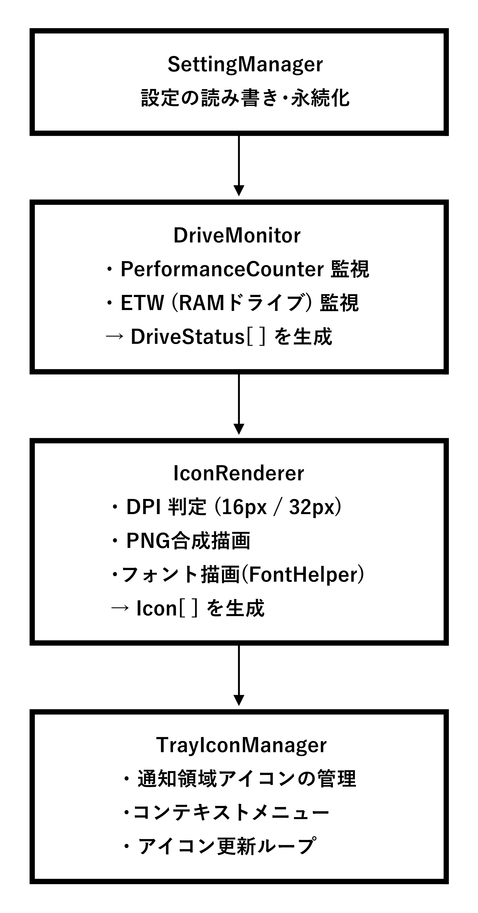
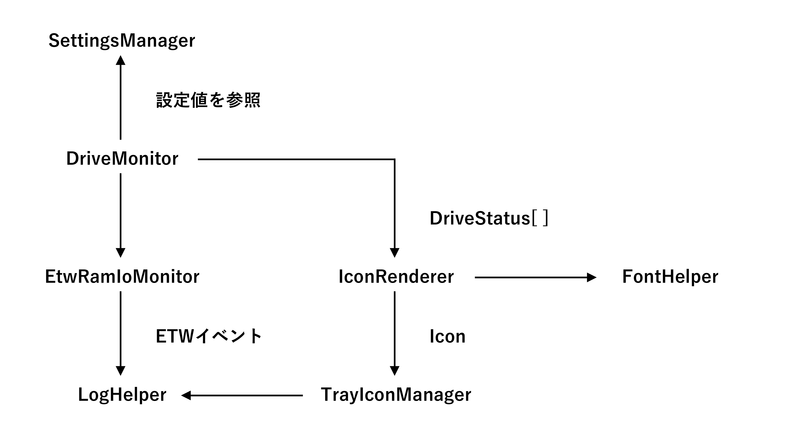
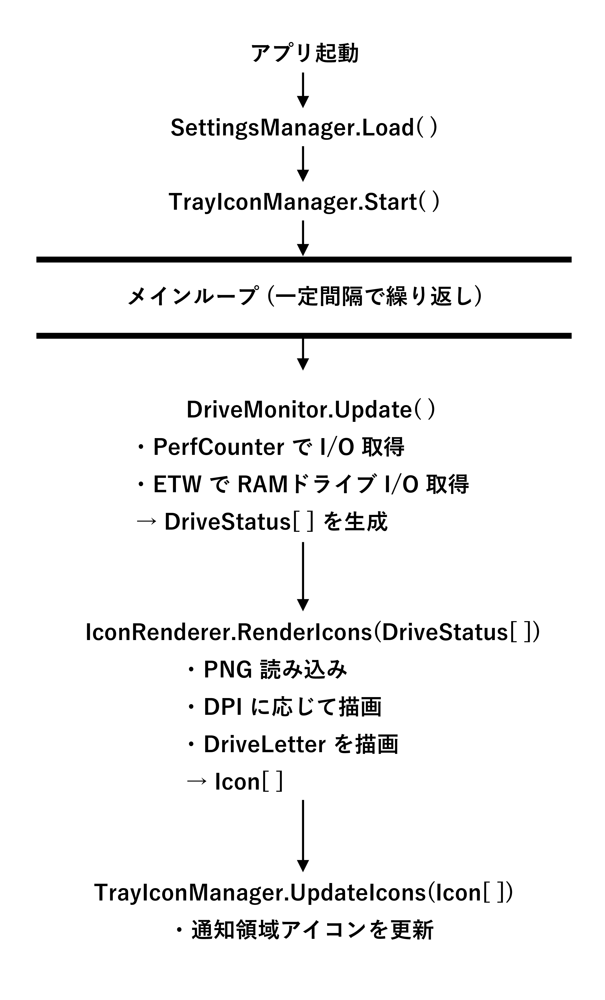

[←前へ](01_Overview(ja).md) | [次へ→](03_Components(ja).md) | [先頭へ](00_Technical_documents(ja).md)  

## 2\. アーキテクチャ構成図 (Architecture Overview)  
    Drive Indicator AI は、  
      監視 → 状態更新 → アイコン描画 → 通知領域更新  
    という一連の処理を、複数の独立したコンポーネントが協力して実現する構造になっています。  
    ここでは、全体構造を ｢コンポーネント図｣ ｢クラス依存関係図｣ ｢処理フロー図｣ の3つに分けて説明します。  

### 2.1 コンポーネント構成図 (Component Diagram)  

### 2.2 クラス依存関係図 (Class Dependency Diagram)  
 

    依存関係のポイント  
      ･ TrayIconManager はアプリの中心で、DriveMonitor と IconRenderer の両方を使う  
      ･ DriveMonitor は PerfCounter と ETW を統合  
      ･ IconRenderer は FontHelper を利用  
      ･ LogHelper は全コンポーネントから参照される (横断的関心事)  
      ･ SettingsManager は全体の設定を提供する基盤  

### 2.3 処理フロー図 (監視 → 描画 → 表示)  
    Drive Indicator AI のメインループは以下のように動作します。  

### 2.4 アーキテクチャの特徴 (まとめ)  
    ･ 責務分離が明確  
        UI / 設定 / 監視 / 描画 / ログ が完全に独立  
    ･ 拡張性が高い  
        新しい言語・アイコンテーマ・監視方式を追加しやすい  
    ･ DPI 対応が堅牢  
        IconRenderer と FontHelper が DPI 差を吸収  
    ･ RAMドライブ 監視が強力  
        ETW を使うことで一般的なツールでは取得できない情報を取得可能  
    ･ ログが全体を支える  
        例外や内部動作をすべて記録し、デバッグしやすい  

[←前へ](01_Overview(ja).md) | [次へ→](03_Components(ja).md) | [先頭へ](00_Technical_documents(ja).md)  