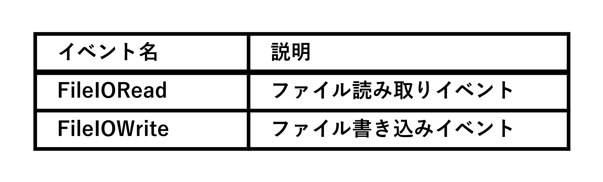

[←前へ](06_DPI(ja).md) | [次へ→](08_Startup(ja).md) | [先頭へ](00_Technical_documents(ja).md)  

## 7\. ETW 詳細 (Event Tracing for Windows Details)  
    Drive Indicator AI の最大の特徴のひとつが、  
    RAMドライブ の I/O を ETW (Event Tracing for Windows) で高精度に監視できることです。  

    通常の PerformanceCounter では RAMドライブ の I/O を取得できません。  
    そのため、Drive Indicator AI は ETW の FileIORead / FileIOWrite イベントを直接解析し、  
    RAMドライブ の読み書きを正確に検出しています。  
    この章では、その仕組みを開発者向けに詳しく説明します。  

### 7.1 なぜ ETW が必要なのか  

#### 7.1.1 PerformanceCounter の限界  
    Windows の PerformanceCounter (LogicalDisk) は :  
      • RAMドライブ を ｢ディスク｣ と認識しない  
      • 読み取り/書き込みバイト数が常に 0  
      • 一部の RAM ディスクソフトではインスタンスが存在しない  
    そのため、通常の方法では RAMドライブ の I/O を監視できない。  

#### 7.1.2 ETW の利点  
    ETW は Windows カーネルが発行するイベントを直接取得できるため :  
      • RAMドライブ でも確実に I/O を検出  
      • バイト数を正確に取得  
      • 高速・低負荷  
      • 管理者権限不要 (FileIO 系イベントはユーザーモードで取得可能)  
    Drive Indicator AI が RAMドライブ を正確に監視できる理由はここにあります。  

### 7.2 ETW で監視するイベント  
    Drive Indicator AI が監視している ETW イベントは以下の 2種類です :  
 

    これらは KernelTraceControl プロバイダから発行されます。  

### 7.3 EtwRamIoMonitor の構造  
    EtwRamIoMonitor は、RAMドライブ 専用の監視クラスです。  

      EtwRamIoMonitor  
        ├─ Start()  
        ├─ Stop()  
        ├─ ProcessEvent()  
        ├─ CancellationToken  
        └─ DriveLetter → ReadBytes / WriteBytes  

#### 7.3.1 Start()  
    • TraceEventSession を作成  
    • FileIORead / FileIOWrite を購読  
    • 別スレッドでイベント処理を開始  

#### 7.3.2 Stop()  
    • CancellationToken を発行  
    • セッションを安全に停止  
    • スレッドを確実に終了  

#### 7.3.3 ProcessEvent()  
    • イベントから DriveLetter を抽出  
    • バイト数を DriveMonitor に渡す  
    • 読み取り/書き込みフラグを更新  

### 7.4 DriveLetter の抽出方法  
    ETW の FileIO イベントには、ファイルパス (例 : C:\\path\\file.txt) が含まれています。  
    Drive Indicator AI はこのパスから :  
      ──────────────────────────────────  
      最初の 1文字 (例 : C)  
      ──────────────────────────────────  
    を DriveLetter として抽出します。  
    RAMドライブ の場合も同様に :  
      ──────────────────────────────────  
      R:\\temp\\file.bin → R  
      ──────────────────────────────────  
    と取得できます。  

### 7.5 スレッドとキャンセル処理  
    ETW はイベントをリアルタイムで受け取るため、専用スレッドで処理する必要があります。  
    Drive Indicator AI では :  
      • Task.Run() で ETW スレッドを開始  
      • CancellationTokenSource で停止  
      • Stop() 呼び出し時に安全に終了  
    という構造になっています。  

#### 7.5.1 安全な停止が重要な理由  
    ETW セッションは停止しないと :  
      • セッションが残留する  
      • 次回起動時に ｢セッション名が重複｣ エラー  
      • メモリリークの原因になる  
    Drive Indicator AI は Stop() で確実にセッションを閉じるため、この問題を完全に回避しています。  

### 7.6 DriveMonitor との連携  
    EtwRamIoMonitor は DriveMonitor に対して :  
      • DriveLetter  
      • ReadBytes  
      • WriteBytes  
    をリアルタイムに渡します。  
    DriveMonitor はこれを PerformanceCounter の結果と統合し、最終的な DriveStatus を生成します。  
      ──────────────────────────────────  
      PerfCounter → 通常ドライブ  
      ETW         → RAMドライブ  
      ──────────────────────────────────  
    という役割分担です。  

### 7.7 ETW のテスト方法  
    開発者が ETW の動作を確認するには :  
      1. RAMドライブ を作成 (ImDisk など)  
      2. Drive Indicator AI を起動  
      3. RAMドライブ にファイルをコピー  
      4. アイコンが 赤 / 緑 に変化するか確認  
      5. ログに ETW イベントが記録されているか確認  
    これで ETW が正しく動作していることを確認できます。  

### 7.8 ETW 実装の特徴 (まとめ)  
    Drive Indicator AI の ETW 実装は以下の特徴を持っています :  
      1. RAMドライブ の I/O を正確に取得  
          一般的なツールでは取得できない情報を取得可能。  
      2. 低負荷・高速  
          ETW は Windows 標準の高速トレース機構。  
      3. 管理者権限不要  
          FileIO 系イベントはユーザーモードで取得できる。  
      4. セッション管理が安全  
          Stop() で確実にセッションを終了し、残留を防止。  
      5. DriveMonitor と統合  
          PerfCounter と ETW を統合し、全ドライブを一元管理。  

[←前へ](06_DPI(ja).md) | [次へ→](08_Startup(ja).md) | [先頭へ](00_Technical_documents(ja).md)  